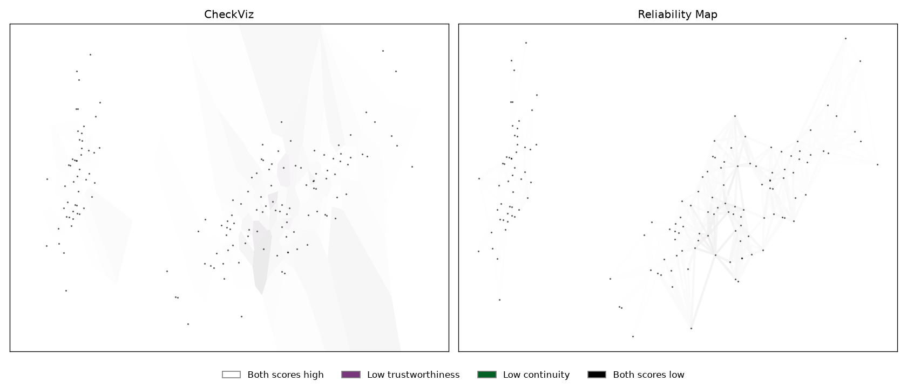

# Visualization

ZADUVis renders pointwise scores with CheckViz and Reliability Map. Install
the visualization extra to use Matplotlib:

```bash
python -m pip install "zadu[vis]"
```

## Compute and render local scores

This example uses the arrays from the [quickstart](../getting-started/quickstart.md).

```python
import matplotlib.pyplot as plt
from zadu import ZADU
from zaduvis import zaduvis

specs = [{"id": "tnc", "params": {"k": 25}}]
runner = ZADU(specs, original, return_local=True)
_, local_scores = runner.measure(projection)

local = local_scores[0]
trustworthiness = local["local_trustworthiness"]
continuity = local["local_continuity"]

fig, axes = plt.subplots(1, 2, figsize=(14, 6))
zaduvis.checkviz(
    projection,
    trustworthiness,
    continuity,
    ax=axes[0],
)
zaduvis.reliability_map(
    projection,
    trustworthiness,
    continuity,
    k=10,
    ax=axes[1],
)
plt.show()
```



Both plots use the same local T&C values. Light regions indicate higher scores;
color distinguishes false-neighbor and missing-neighbor contributions. CheckViz
colors finite Voronoi cells, so boundary cells can remain unfilled. Reliability
Map colors edges using the average scores of their endpoints.

The `k=10` passed to `reliability_map()` sets the displayed neighbor graph. It
does not change the `k=25` used to calculate T&C above. Supply local preservation
scores directly; do not invert them into error values. The projection must have
two columns; CheckViz requires geometry suitable for a Voronoi diagram.

CheckViz originates from
[Lespinats and Aupetit (2011)](https://doi.org/10.1111/j.1467-8659.2010.01835.x).
Reliability Map is described by
[Jeon et al. (2022)](https://doi.org/10.48550/arXiv.2107.07859).
